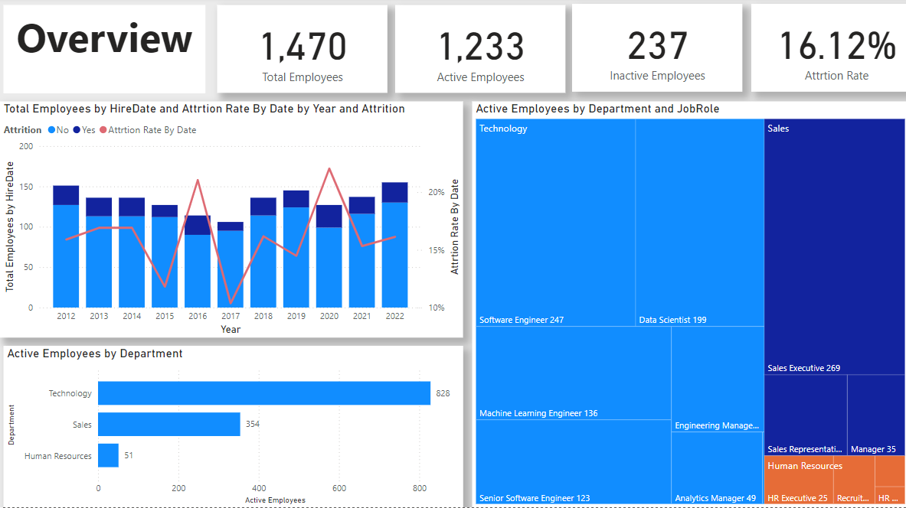
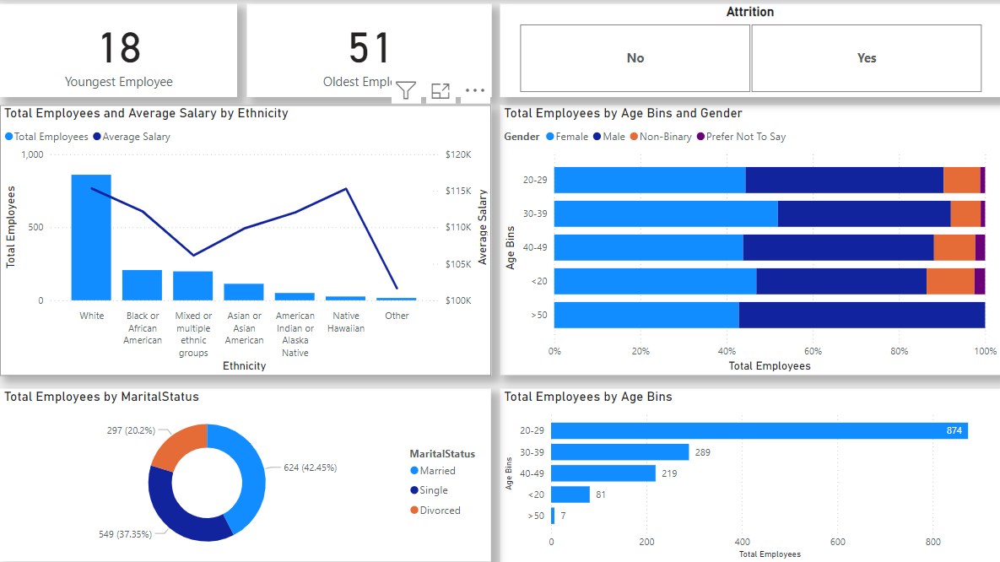
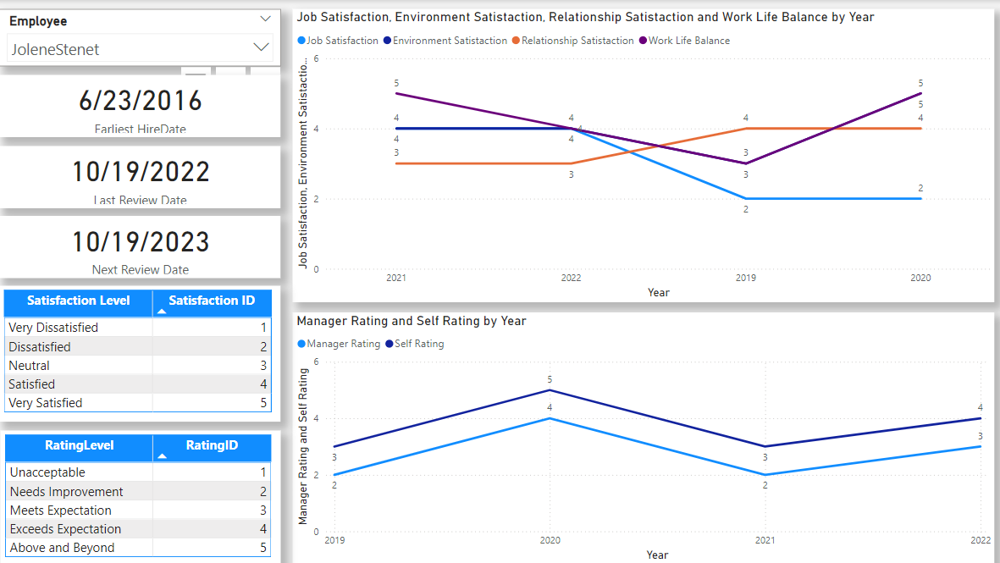
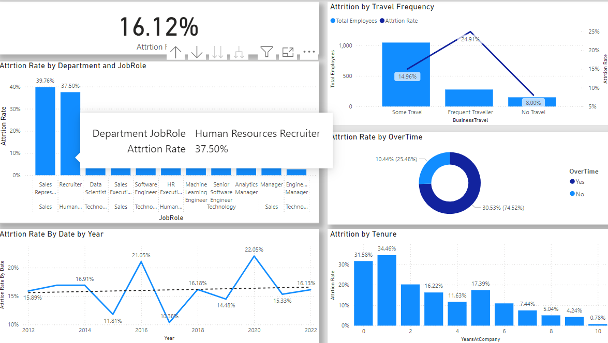

# HR Analytics in Power BI: Employee Attrition Analysis

## Overview

This project is a comprehensive case study on **HR Analytics in Power BI** that focuses on analyzing employee attrition at Atlas Labs, a fictitious software company. The analysis leverages various data visualization techniques and key HR metrics to uncover insights about employee demographics, satisfaction levels, performance ratings, and the factors contributing to attrition.

## Objectives

- To understand the key factors contributing to employee attrition.
- To analyze employee demographics, satisfaction, and performance to identify patterns and trends.
- To provide actionable insights for the HR team to improve employee retention and satisfaction.

## Key Insights

1. **Employee Headcount and Department Distribution**:
   - Atlas Labs has employed over **1,470 people** since its inception.
   - Currently, the company employs over **1,200 people**.
   - The largest department by far is **Technology**, indicating a strong focus on tech-driven growth.

2. **Employee Attrition**:
   - The attrition rate for employees leaving the organization is **16%**.
   - There is a clear trend between travel frequency and attrition. Reviewing the policy and ensuring that travel is necessary, along with gathering employee feedback, could help improve retention.

3. **Employee Demographics**:
   - The majority of employees are between **20-29 years old**.
   - Atlas Labs currently employs **2.7% more women** than men.
   - Employees who identify as **non-binary** make up **8.5%** of the total workforce.
   - Employees identifying as **White** have the highest average salary, while those from **Mixed or multiple ethnic groups** have one of the lowest average salaries.

4. **Employee Satisfaction and Performance**:
   - Multiple factors such as job satisfaction, environment satisfaction, relationship satisfaction, and work-life balance were analyzed by year.
   - Ratings from both managers and self-assessments were tracked to identify discrepancies or patterns in performance reviews.

## The Report created in Power BI includes the following visualizations and measures:

1. **Overview**:

2. **Demographics**

4. **Individual Employee Performance**:

4. **Attrition Analysis**:

## How to Use the Dashboard

1. **Filter by Employee**: Use the slicer to filter data by an individual employee to analyze their performance, satisfaction, and review timelines.
2. **Analyze Demographics**: View employee distribution by age, gender, marital status, and ethnicity to understand diversity and salary disparities.
3. **Review Attrition Trends**: Utilize charts to identify trends related to attrition, such as travel frequency and satisfaction levels, to inform policy changes.

## Conclusion

The analysis provides critical insights into factors contributing to employee attrition at Atlas Labs. By focusing on areas such as employee demographics, satisfaction, and travel frequency, the HR team can create targeted strategies to improve retention, enhance job satisfaction, and foster a more inclusive workplace.

## Tools Used

- **Power BI**: For data visualization and dashboard creation.
- **DAX (Data Analysis Expressions)**: To create calculated columns and measures for various KPIs.
  

